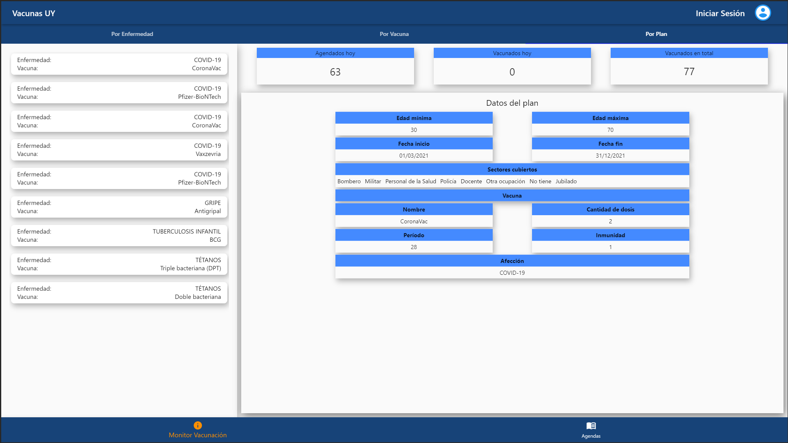
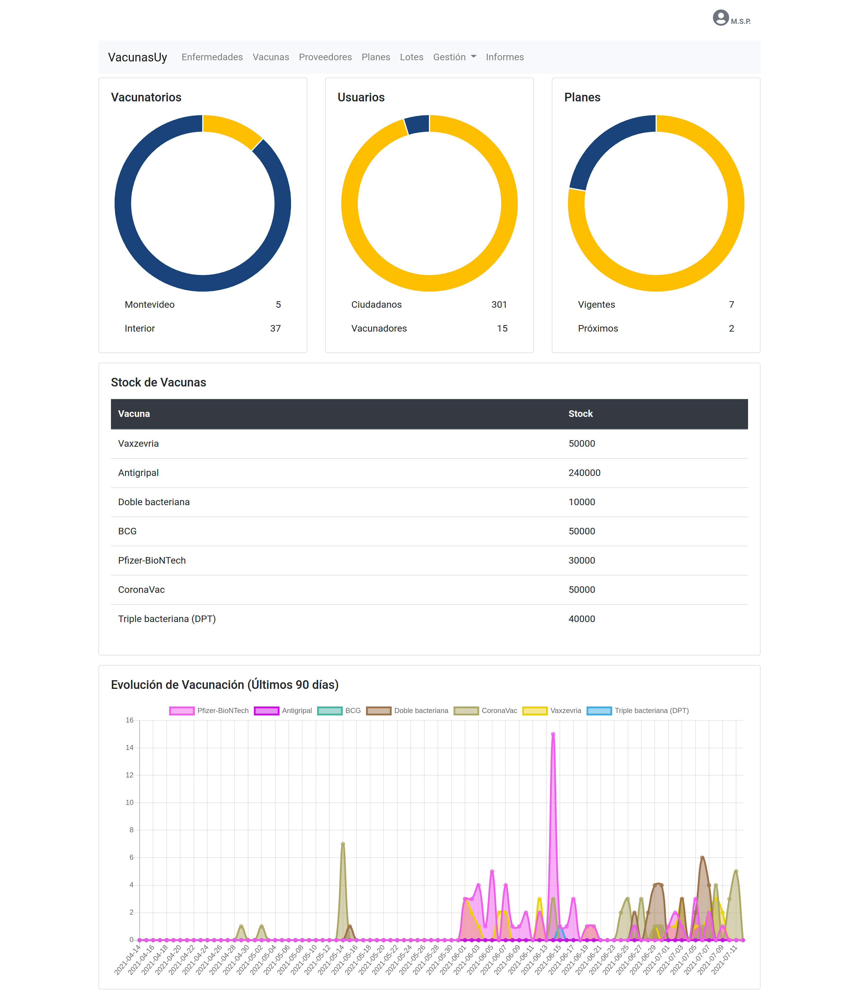

# VacunasUY

Laboratorio para la asignatura Taller de Sistemas Empresariales de la Facultad de Ingeniería (FIng-UdelaR).

## Contenido

1. [Links](#links)
2. [Datos de prueba](#datos-de-prueba)
3. [Descripción](#descripción)
4. [Screenshots](#screenshots)
5. [Tecnologías](#tecnologías)
6. [Despliegue](#despliegue)

## Links

- [VacunasUy - Frontoffice web](http://vacunasuy.web.elasticloud.uy)
- [Nodos periféricos](https://nodos-perifericos.herokuapp.com/)
- [Nodos externos](https://nodos-externos.herokuapp.com)

## Datos de prueba

Usuarios por defecto en backoffice:

- Perfil: Administrador / Correo:  admin@admin.com / Contraseña: 1234
- Perfil: Autoridad / Correo: msp@gub.uy / Contraseña: 1234

## Descripción

La plataforma VacunasUy surge en el contexto actual, a nivel mundial, que está atravesando la sociedad por la pandemia de Coronavirus (COVID-19). Si bien ya se cuenta con vacunas desarrolladas para combatir esta enfermedad, es necesario, a su vez, contar con un sistema informático que sea capaz de gestionar todo el ciclo de vacunación, desde la recepción de las unidades, envío a los centros de vacunación, asignación del personal de la salud para realizar las vacunaciones, así como también permitir a los ciudadanos inscribirse en las distintas agendas para recibir las vacunas, entre otras funcionalidades. Además, no solo se espera que esta plataforma pueda gestionar el contexto actual, sino que pueda utilizarse a futuro para gestionar cualquier plan de vacunación.

Más información en el documento de arquitectura. 
`Documentacion/documento-de-arquitectura-de-software.pdf`

### Screenshots

Frontoffice web

Frontoffice mobile

Backoffice web

## Tecnologías

- JakartaEE
- PostgreSQL con PostGIS
- Java (para Android)
- Flutter
- JQuery
- SpringBoot
- MongoDB

## Despliegue

- WildFly 21
- [Mi Nube - Elastic Cloud](https://minubeantel.uy/)
- Firebase
- Heroku
- MongoDB Atlas

